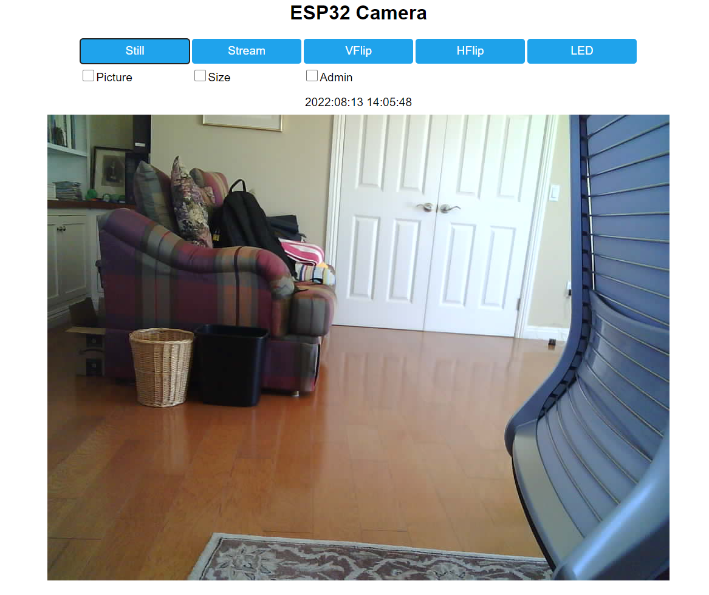

# ESP32 Camera app

My app for a ESP32 Camera board. Still somewhat a work-in-progress but basic functionality works.
Built with pure esp-idf rather than Arduino/ESP32. Only supports OV2640 sensor at present.
The stream is MJPEG. 

Provides still photos and streaming. Prototypes get up to ten FPS.

Uses httpd work queue to make streaming response async and allow multiple clients for better behavior than 
some apps.

Supports OTA update via the UI. Currently no authorization needed for updating so only expose to your local 
network.

# Screen shot

# Wifi configuration 

Only supports configuring wifi at build time at present. Up to two access points can be configured. To
do this in the "main" source directory create a header file wifi_details.h.

# Building

Use plain idf. So clone the repository, configure wifi and then use 

    idf.py build

to build the image.